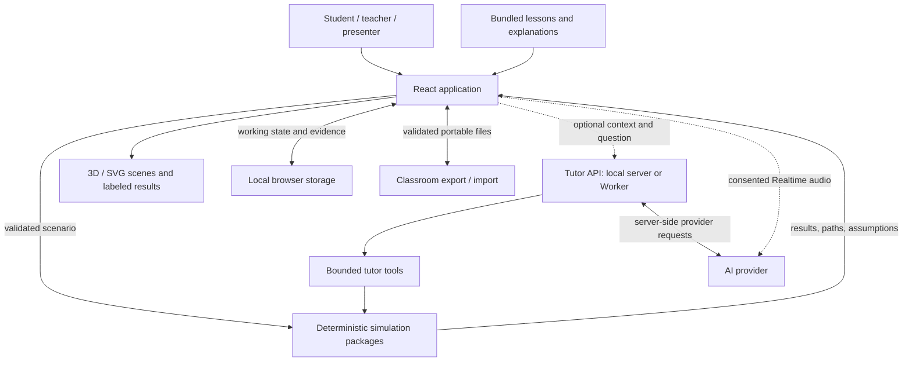

# BIG SIGNAL — Radio Science Lab: Architecture

**Documentation baseline: 19 September 2026.** This describes the repository's implemented boundaries, not a certification of deployment availability or model accuracy. See the [BRD](../BRD.md) for purpose, [PRD](../PRD.md) for acceptance criteria, and [project structure](PROJECT_STRUCTURE.md) for code placement.

## System overview

BIG SIGNAL is a browser-first educational simulator with an optional server-side tutor. The deterministic engine is shared by manual experiments and tutor tools. The application does not transmit radio signals or provision a communications network.

Solid lines describe the core app and server operations; dotted lines highlight optional provider-dependent communication. The diagram separates display geometry from calculated physics. Voice audio does not pass through the deterministic RF engine.

## Component responsibilities

| Component | Owns | Must not do |
| --- | --- | --- |
| `apps/web/src/ProductApp.tsx` | Navigation, active experiment, lesson/tour orchestration | Duplicate RF formulas or bypass evidence rules |
| `apps/web/src/app/navigation.ts` | Page identifiers and navigation labels | Define physics or learning progress |
| `apps/web/src/features/guides`, `features/walkthrough` | Concept stories, visual tour, local styles/tests | Present illustrative paths as computed coverage |
| `LabWorkspace`, controls, results, scenes | Deliberate runs, configuration, result presentation | Infer link success from an animation |
| `content/` and `packages/missions` | Teaching copy, curriculum, mission assessment, portable-file rules | Hide model assumptions inside marketing copy |
| `packages/contracts` | Shared versioned scenario/result types and validation boundaries | Change silently between UI and engine |
| `packages/simulation`, `propagation`, `units` | RF results, laboratory helpers, network calculations, numeric units | Depend on React rendering state |
| `packages/tutor` | Context validation, engine-grounded summaries, allowed actions | Treat model prose as authoritative RF output |
| `apps/server` | Provider adapter and shared HTTP handler; local listener | Expose provider credentials to the browser |
| `apps/worker` | Worker/static-asset adapter using the shared handler | Import the local filesystem/listener entry point |

Unqualified UI filenames in this table are under `apps/web/src`. Existing legacy components remain there; feature grouping is incremental rather than a completed migration of every screen.

## Experiment lifecycle

1. Load a bundled mission, a validated portable file, or recover a valid saved setup.
2. Collect a prediction when the current learning flow requires one. It gates the action, not the physics.
3. On **SEND IT**, validate scenario inputs and call the applicable engine entry point.
4. `simulateScenario` calculates the link. `simulateLaboratory` composes extended laboratory/physics settings. `simulateNetwork` evaluates configured edges in both directions and derives network results.
5. Render engine paths, labeled status, quantities, warnings, limiting factors, and calculation details. An unavailable route remains unavailable even if a hypothetical budget is positive.
6. Record eligible student evidence separately from tutor demonstrations. Save/export only through the relevant explicit action.
7. Changing a setting requires a new deliberate run before treating the result as evidence for that setup.

## Runtime and deployment topology

| Mode | Browser and assets | Optional API | Notes |
| --- | --- | --- | --- |
| Local development | Vite, normally `127.0.0.1:5173` | Separate local server at port `8787`; Vite proxies `/api` | Run `bun run dev` and optionally `bun run dev:server` |
| Local production preview | Built `apps/web/dist` via Vite preview | Proxy requires the separate server and an allowed origin | Useful for offline-cache checks; not a deployment |
| Combined local server | `apps/server/index.ts` serves the built app | Shared tutor handler on the same origin | `bun run build`, then `bun start` |
| Configured Cloudflare deployment | Worker Static Assets | Worker adapter dispatches `/api` and `/api/*` | `wrangler.jsonc` and CI define deployment; secrets remain external |

The configured custom domain is `bigsignal.edmundlim.systems`. This document does not verify its current availability. See [Cloudflare setup](CLOUDFLARE.md) for CI checks, routes, required secrets, and the distinction between local access-code protection and Worker behavior. A static-only host can serve the lab but cannot execute tutor API routes.

### Tutor API boundary

| Route | Method | Responsibility |
| --- | --- | --- |
| `/api/tutor/status` | GET | Report configuration presence; not a provider connectivity test |
| `/api/tutor/chat` | POST | Validate context/history and perform a bounded text-agent request |
| `/api/tutor/realtime` | POST | Create the server-authorized voice connection |
| `/api/tutor/context` | POST | Validate updated context and build refreshed voice instructions |

Consult `apps/server/app.ts` for the request contract and limits. Origin validation, bounded bodies/history, rate/concurrency limits, and sanitized failures protect the API boundary. Worker rate limits are per isolate, not a global spend cap. No provider secrets belong in a `VITE_` variable, screenshot, portable experiment, or client bundle.

## Persistence, offline use, and failure recovery

- Working experiments, notebooks, and mastery are local browser data. They are not a cloud account or backup; users should export important experiments.
- Single experiments, networks, and wire geometries have distinct validated file formats and import surfaces. Arbitrary imported fields are not executable instructions.
- A production service worker caches the application shell and referenced JS/CSS. Core data is bundled. Development mode is not proof of offline readiness; wait for the production UI's readiness state and perform an offline reload.
- API requests are excluded from offline handling. Missing keys, denied microphone permission, network failure, or provider errors must leave manual experiments available.
- Invalid saved data recovers through validation/defaults; storage areas are recovered independently. Clear-site-data actions can remove learner progress and should not be the first troubleshooting step.
- Heavy graphics can fall back to POTATO/SVG while retaining the same result. Visual scaling and exaggerated terrain heights never modify the scenario.

## Verification strategy

Run `bun run typecheck`, `bun run test`, `bun run test:physics`, and `bun run build` for application changes. Worker packaging/runtime checks are documented separately in [Cloudflare setup](CLOUDFLARE.md). Record the tested revision and results rather than treating old test totals as permanent evidence.

Automated checks cover contracts, numerical behavior, curriculum/storage rules, rendering helpers, and mocked tutor interactions. Browser acceptance must additionally cover navigation, focus/hover/disabled states, mobile controls, file exchange, offline reload, and graphics fallback. Live narration, language quality, microphone teardown, provider permissions, and billing require separate configured-provider checks; mocked tests cannot establish them.

## Design decisions and known limits

- **One authoritative engine:** keeps human and AI-driven experiments scientifically consistent.
- **Local-first core:** supports classrooms and presentations without compulsory accounts or provider access.
- **Typed, bounded tutor actions:** allows assistance without unrestricted code execution or automatic mastery awards.
- **Model transparency over realism claims:** simplified terrain/HF conditions and analytical antenna patterns are disclosed; wire drawing is not a full-wave solver.
- **Current tradeoffs:** substantial graphics bundles, browser-local persistence, and deployment-specific rate limits need measured review before production commitments. Performance targets in the build plan are not measured guarantees.

The following sections retain the detailed calculation and integration contract notes.

## Calculation boundary

`Scenario` enters `simulateScenario` from `@bigsignal/simulation`, and `SimulationResult` returns all RF results. The web adapter uses that entry point directly. React renders the result and never computes path loss, noise, SNR, or link margin.

The `integration` checkpoint combines `engine` and `experience` without changing the engine's version 1 contracts. `EnvironmentConfig` selects free space, VHF terrain, or HF skywave with explicit model inputs. The UI missions load complete engine scenarios and set the HF endpoints and demonstration time.

`validateScenario` checks inputs at the engine boundary. Persisted settings use the same validator. Invalid saved settings fall back to the mission default, and simulation validation errors appear in the UI.

`propagationAvailable` distinguishes a supported route from a hypothetical budget. When it is false, the UI displays the failed status and a warning next to the numeric results even if the hypothetical margin is positive.

See [contract notes](../packages/contracts/README.md) for the schema and [simulation documentation](../packages/simulation/README.md) for thresholds, mode profiles, assumptions, and confidence semantics.

## Geometry and explanations

Engine paths contain latitude and longitude in degrees and altitude in metres above mean sea level. Endpoint altitude already includes antenna height. The globe renders these coordinates directly.

The terrain view projects geographic points onto the transmitter-to-receiver profile. It places the single obstruction at the middle of the illustration by stretching each side independently. A shared projection places the antenna tips, terrain crest, and returned paths in the same coordinates. Heights and spacing are exaggerated for visibility. This is display geometry and does not change the engine result.

Educational text lives in `content/explanations`. The engine returns explanation keys, warnings, calculation nodes, and ranked limiting factors. The UI displays each, including cases where restoring a path matters more than a numeric dB improvement.

## Runtime and validation

Simulation runs on SEND IT, never in the render loop. Graphics modes change rendering detail without changing physics. The app bundles its data and runs without a cloud backend. A production service worker caches the built app for offline reloads.

Use root `validation/` for physics and numerical checks. Web integration tests exercise mission inputs, engine responses, persisted settings, and terrain projection. Run the full test suite and production build before publishing changes. Browser checks must also cover the VHF power and height experiment and HF above-MUF behavior.

## Product domains

The product composes the existing scenes and version 1 RF contracts with a typed lesson registry in `content/lessons.ts`. `packages/missions/product.ts` owns assessment and portable-file validation. The lesson runner records prediction, attempts, transfer answers, and applied evidence without changing simulation accuracy across tiers.

`ProductApp` coordinates navigation and the working experiment. `LabWorkspace` runs the engine on SEND IT and renders results, comparisons, and teacher checks. `productStorage` recovers the working experiment, notebook entries, and mastery independently. Imported classroom data passes the same schema parser used for export.

Energy, impedance, cable, receiver, Fresnel, and fantasy helpers live in `packages/simulation/src/laboratory.ts`. Networks are an additive graph domain in `network.ts`; each edge invokes the same Scenario engine for both directions. No existing Scenario or SimulationResult field was removed or renamed.

The custom wire editor stores geometric points and segments separately. It does not infer gain, impedance, or resonance from arbitrary wire geometry. The SVG scene fallback projects returned path points and uses the same terrain projection as the 3D view.

## Contextual tutor and focused workspace

Lesson phases and workspace views select which mounted surface is shown, preserving simulation and mastery state. The map and radio controls have independent scroll areas. Disaster Lab exposes its live NetworkScenario to ProductApp through a typed callback. TutorPanel receives the current context and applies validated tutor actions through ProductApp. Demonstrations update controls and rerun results without recording attempts or mastery. A snapshot check rejects stale actions, and Undo restores the prior setup only if the learner has not since edited it.

The optional server lives in apps/server. It serves the production artifact and /api/tutor endpoints; Vite proxies the same routes during development and preview. packages/tutor validates context, builds bounded prompts from authoritative engine summaries, and supplies read-only hypothetical experiments plus a shared whitelist of editable numeric controls and antenna presets. Text edits are staged per request and atomically applied only after a successful response; voice tools execute only from completed responses, deduplicate call IDs, and return authoritative results through the Realtime function-output protocol. Text uses the OpenAI Agents SDK and voice uses server-created Realtime WebRTC calls. Standard credentials never reach the client. API routes are excluded from service-worker handling.

Voice has explicit connecting/listening/thinking/speaking states and tears down microphone tracks, peers, and pending requests on exit. Experiment changes refresh voice instructions or stop the session if refresh fails. Text requests are cancelled when their context changes. Recent history is bounded to the server contract; neither server conversation persistence nor provider tracing is enabled. Live-provider verification requires an API key.

The project walkthrough adds bounded language, visible-page and stop metadata to TutorContext. WalkthroughConsole renders local teaching content; ProductApp owns its page navigation. The voice-only guide_walkthrough tool selects one of five known stops or closes the guide, without editing experiment settings. Completed calls are deduplicated and checked against the response snapshot. Navigation ends the action batch and forces the follow-up response to narrate without tools; normal context refresh supplies the new page before later user requests. A separate narration request opens the consent panel and waits for an explicitly started voice connection. Lab edits from informational pages are rejected. The tour never marks learning progress or saves/exports files.
